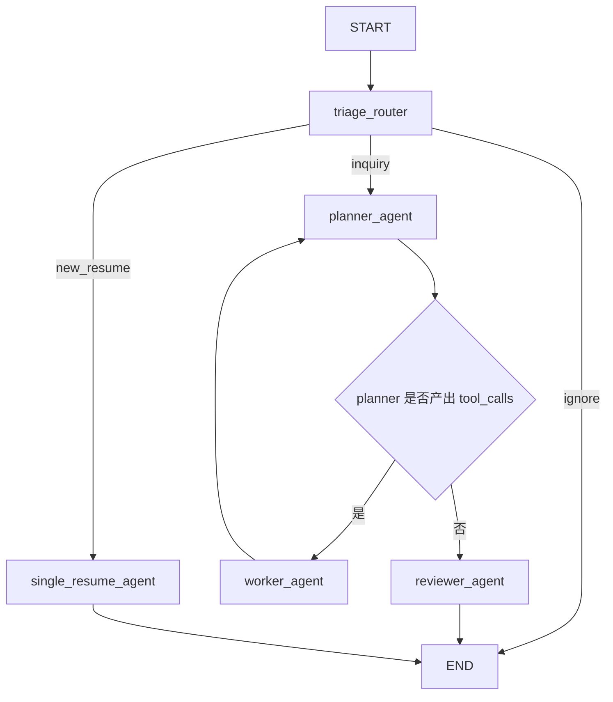
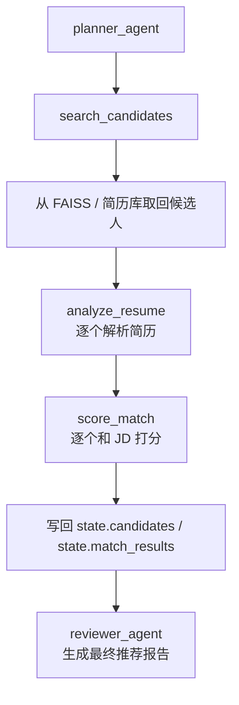
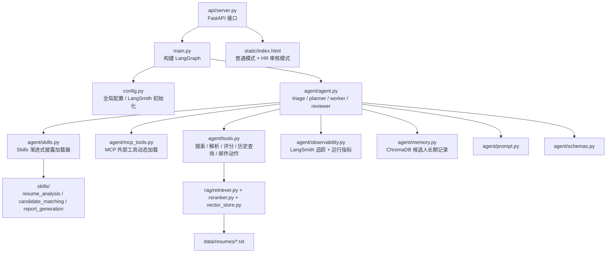

# 真正落地出来的图

这个文件汇总当前 `hellojobs` 项目已经落地实现的三张核心结构图，方便和最初的 `demo.md` 目标架构对照查看。

## 1. 主工作流图

当前系统的主流程是一个 LangGraph 编排链路，核心入口在 `main.py`，节点实现主要在 `agent/agent.py`。

## 2. Worker 内部执行图

虽然现在还不是多个并行 Worker Agent，但 `worker_agent` 已经把招聘主链真正串起来了。

## 3. 项目模块图

从代码组织上看，当前项目已经形成了 API、Agent、RAG、Memory、Skills 和前端页面几个层次。

